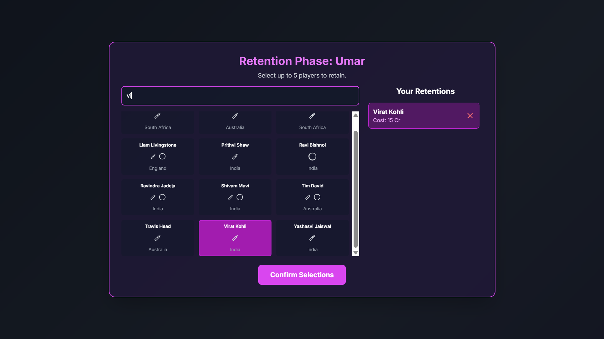
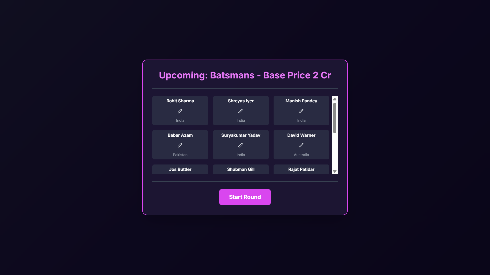
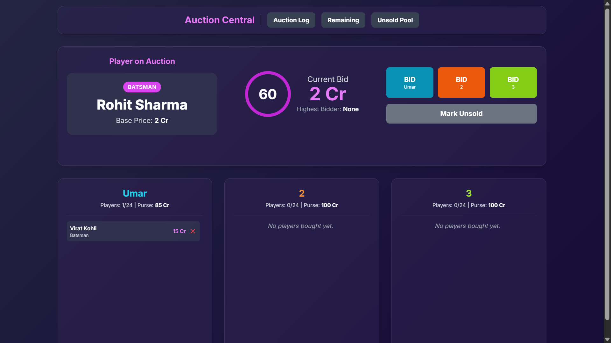
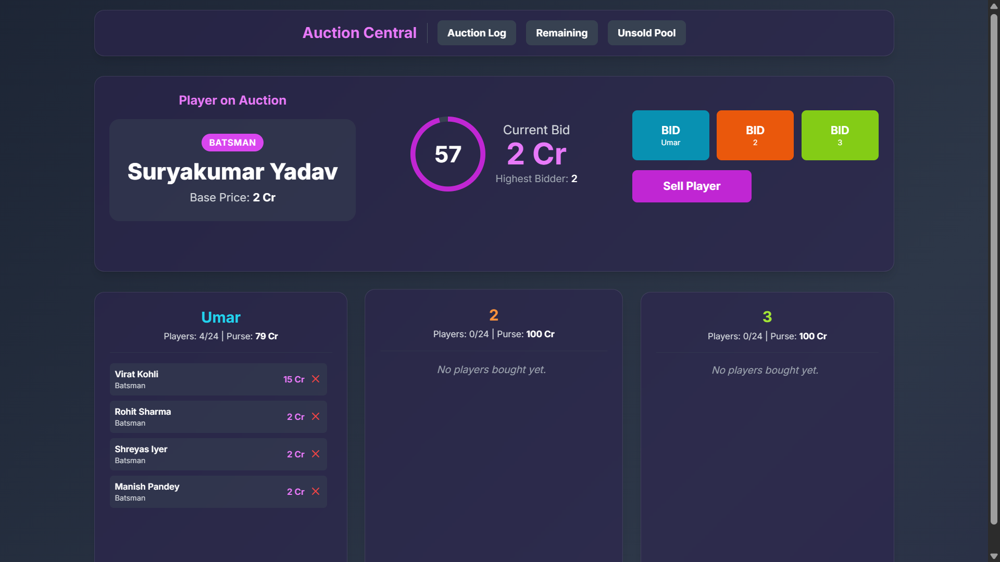
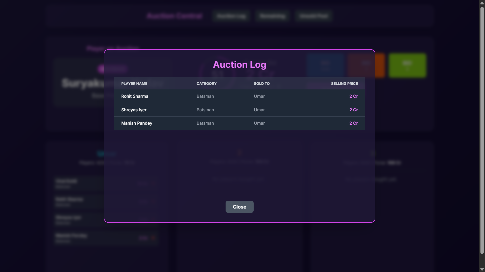
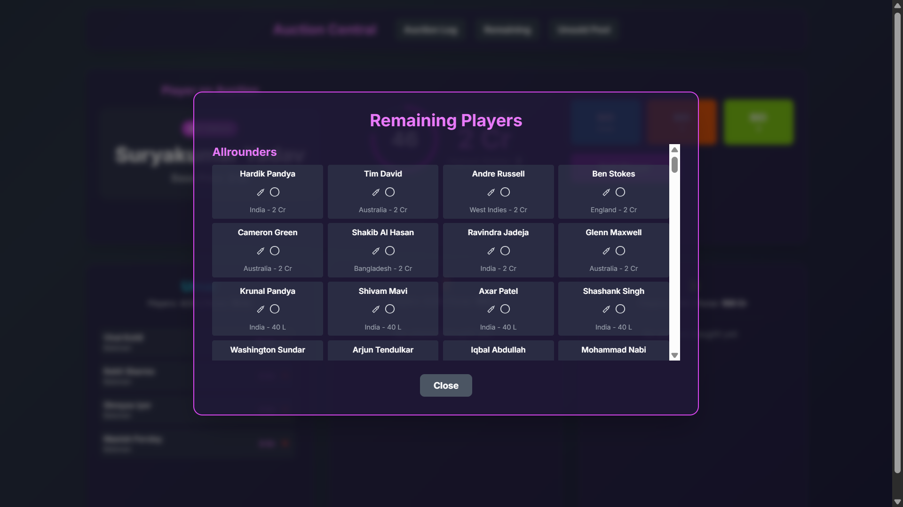
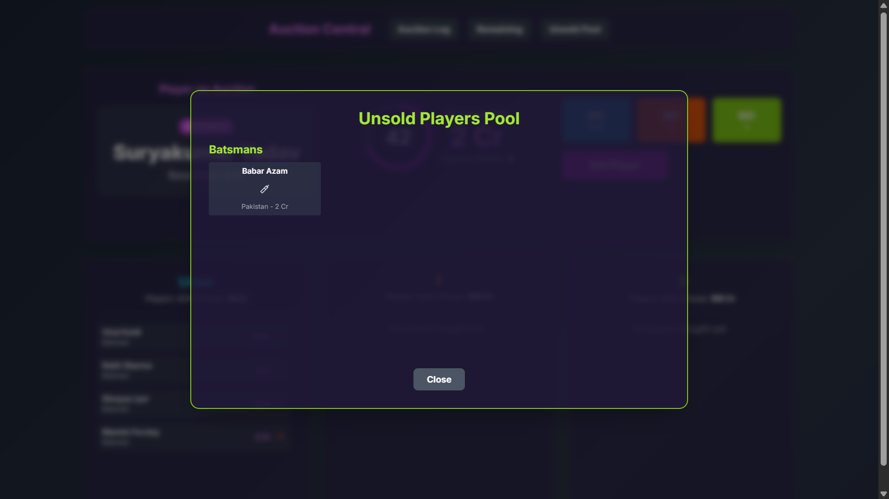

# 🏏 Cricket Auction Simulator

**Cricket Auction Simulator** is a dynamic, single-page web application that recreates the high-stakes excitement of a live T20 league player auction — right in your browser.
Built with **Vanilla JavaScript** and **Tailwind CSS**, it delivers an immersive, feature-rich experience for cricket enthusiasts who love strategy, competition, and team building.

Manage your franchise, outbid rivals, and craft a championship-winning squad from a pool of world-class cricketers.

---

## 🔮 Roadmap / Future Enhancements

Planned improvements and features in upcoming versions:

* [ ] **Player Roles & Squad Rules** (e.g., overseas limits, minimum wicketkeepers)
* [ ] **Pre-Auction Mock Draft** mode for strategy planning
* [ ] **More Player To Be Added ( 200+ Currently)**
* [ ] **Layout Change**
* [ ] **Animation UI**
* [ ] **Custom Team Logos & Colors** for personalization**
* [ ] **Multi Team Support (Currently only 3 Teams Supported**


---

## 📸 Screenshots

<p align="center">
  
  
  
  
  
  
  
  
</p>


---
## ✨ Key Features

🎯 **Team Customization**
Create and name your own **three franchises** before the auction begins.

⏱️ **Real-time Bidding System**
Engage in intense 60-second bidding rounds for each player.

🛡️ **Player Retention**
Retain up to **five key players** from your previous roster before the main auction.

🃏 **Right to Match (RTM) Cards**
Use your one-time RTM card strategically to reclaim a player your team previously owned.

📊 **Live Stats Dashboard**
Monitor the most expensive player, biggest bargains, and overall team statistics in real-time.

🔊 **Immersive Sound Effects**
Experience realistic auction vibes with audio cues for bidding, sales, and timers.

🔄 **Full Auction Lifecycle**
Go through every phase — from **retention** to **accelerated rounds** for unsold players.

🗂️ **Comprehensive Logs**
Access detailed logs of sold, remaining, and unsold players anytime.

↔️ **Dynamic Team Management**
Release players to free up funds and roster space during the auction.

💾 **Save & Load Progress**
Pause your auction anytime and resume exactly where you left off.

---

## 🚀 Getting Started

Getting the application running is simple — **no installation or build steps** are required.

### 1️⃣ Clone the Repository

```bash
git clone https://github.com/your-username/cricket-auction-simulator.git
```

Or download the `index.html` file directly from the repository.

### 2️⃣ Navigate to the Project Directory

```bash
cd cricket-auction-simulator
```

### 3️⃣ Open in Browser

Simply **double-click** the `index.html` file — it will open directly in your browser (Chrome, Firefox, Safari, etc.).

### 4️⃣ Start the Auction!

Customize your team names and begin bidding to build the ultimate T20 franchise.

---

## 🛠️ Technologies Used

* **HTML5** – Core structure and semantic markup
* **Tailwind CSS** – Modern, responsive, utility-first design
* **Vanilla JavaScript (ES6+)** – Application logic, state management, and interactivity
* **Tone.js** – Audio library for immersive sound effects and feedback

---


## 🧾 License

This project is open-source and available under the **MIT License**.
See the [LICENSE](./LICENSE) file for more details.

---

## 💡 Contributing

Contributions are welcome!
If you'd like to add features or fix bugs:

1. Fork the repo
2. Create a new branch (`feature/new-feature`)
3. Commit your changes
4. Submit a pull request 🎉

---

## 🏆 Credits

Created with ❤️ by [Umar Mahtab](https://github.com/umarmahtab) — inspired by the passion and thrill of cricket.

---
